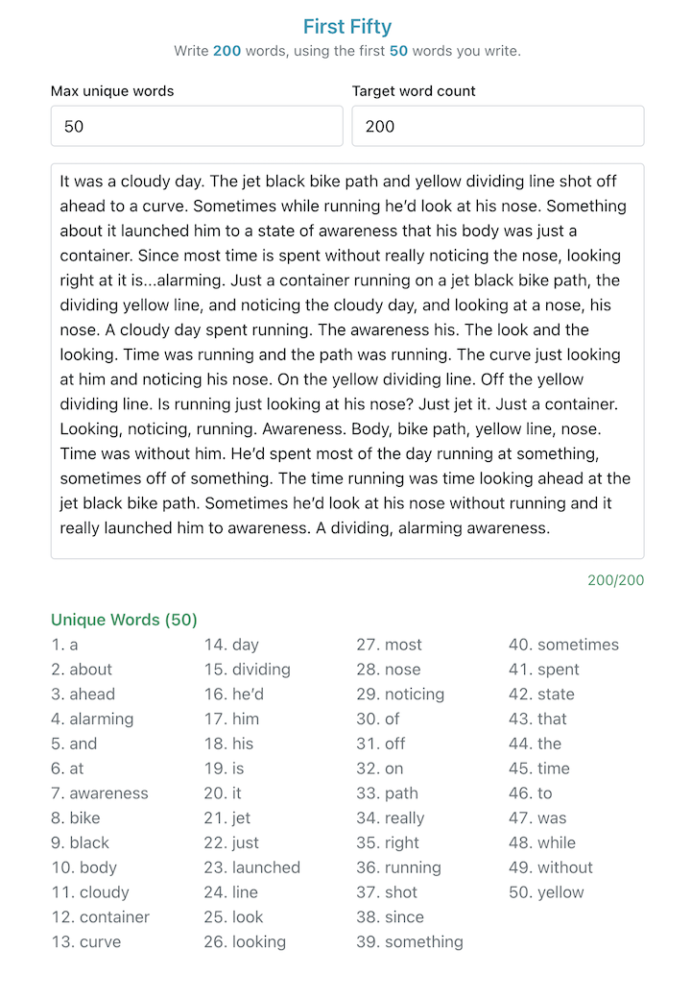

# [First Fifty](https://first-fifty.vercel.app/)

This is a writing tool to aid in an exercise from [George Saunder's](https://georgesaundersbooks.com/) book [A Swim in a Pond in the Rain](https://www.penguinrandomhouse.com/books/609280/a-swim-in-a-pond-in-the-rain-by-george-saunders/).

It's a delightful premise that is equal parts simple and challenging: write 200 words using only the first 50 words you write. You can configure 200 and 50, 
but the idea is to introduce an arbitrary constraint that lures your unique preferences into the fore as you try to write 150 more words with pure recycling.




Built with [Solid]([Solid Website](https://solidjs.com)) and [Hope UI](https://hope-ui.com/).

---

## Usage

```bash
$ npm install # or pnpm install or yarn install
```

### Learn more on the [Solid Website](https://solidjs.com) and come chat with us on our [Discord](https://discord.com/invite/solidjs)

## Available Scripts

In the project directory, you can run:

### `npm dev` or `npm start`

Runs the app in the development mode.<br>
Open [http://localhost:3000](http://localhost:3000) to view it in the browser.

The page will reload if you make edits.<br>

### `npm run build`

Builds the app for production to the `dist` folder.<br>
It correctly bundles Solid in production mode and optimizes the build for the best performance.

The build is minified and the filenames include the hashes.<br>
Your app is ready to be deployed!

## Deployment

You can deploy the `dist` folder to any static host provider (netlify, surge, now, etc.)
